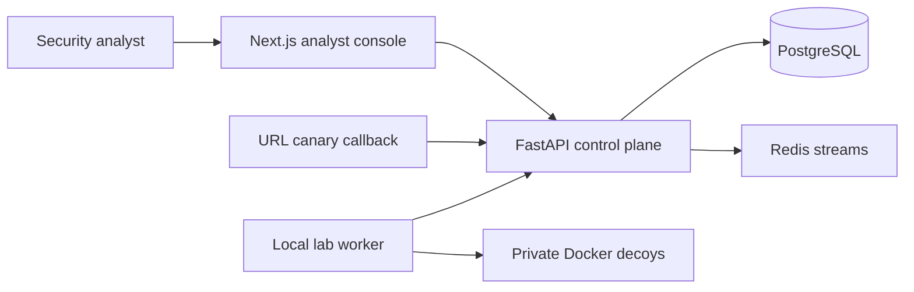

# Deception Orchestrator

> **A self-hostable SOC analyst console for safe deception labs.**

Deception Orchestrator turns controlled decoy and canary activity into MITRE-tagged events, explainable alerts, and investigation timelines. It is built to demonstrate blue-team workflows without requiring a live attacker or an external LLM.

[Quick start](#quick-start) · [Demo flow](#demo-flow) · [Architecture](#architecture) · [Deployment](#deployment) · [Security boundary](#security-boundary)

> [!WARNING]
> This is a defensive lab and portfolio project, not an internet-exposed honeypot platform. Run decoys only on systems and networks you own. The hosted control plane never needs Docker socket access.

## What you can demonstrate

| Capability | What it shows |
| --- | --- |
| **Protected analyst console** | Single-admin login, HttpOnly sessions, CSRF checks, rate limits, and deployment status. |
| **Demo Lab** | A deterministic credential-to-exfiltration scenario using TEST-NET addresses. |
| **Investigation workflow** | MITRE-tagged events, severity scoring, alert triage, and an ordered attack timeline. |
| **URL canaries** | One-time beacon callbacks that generate a critical event and alert. |
| **Local decoy lab** | Explicit, local-only Docker decoys with a separate log-monitor worker. |
| **Optional AI enrichment** | DeepSeek can enrich analysis when configured; deterministic offline rules remain the default fallback. |

## Architecture



The public surface is limited to the authenticated dashboard and an optional URL-canary callback. Docker-managed decoys are a local-lab capability, not a hosted deployment feature.

## Quick start

### Prerequisites

- Docker Desktop or Docker Engine with Compose v2
- A free local port `3000` for the console and `8000` for the API

### Start the safe control plane

```bash
cp .env.example .env
# PowerShell: Copy-Item .env.example .env

# Set SECRET_KEY and ADMIN_PASSWORD in .env, then:
docker compose up --build
```

Open [http://localhost:3000](http://localhost:3000), then sign in with the `ADMIN_USERNAME` and `ADMIN_PASSWORD` from `.env`.

The default configuration works offline. To enable DeepSeek enrichment, set:

```env
LLM_PROVIDER=deepseek
DEEPSEEK_API_KEY=your_key_here
LLM_MODEL=deepseek-v4-flash
```

## Demo flow

1. Open **Demo Lab** and run the safe scenario.
2. Review the generated credential attempts, successful access, command activity, exploit attempt, and canary trip in **Events**.
3. Open the linked **Investigation** to follow the ordered attack timeline and MITRE context.
4. In **Alerts**, acknowledge or resolve the high-confidence findings.
5. In **Canaries**, generate a URL beacon, copy its callback URL, and fetch it once to trigger a critical alert.

The scenario uses documentation-only TEST-NET addresses and follows the same event-processing path as the decoy and canary pipelines.

## Local decoy lab

Docker decoys are disabled by default. Enable them only on a controlled machine:

```bash
docker compose -f docker-compose.yml -f docker-compose.lab.yml up -d --build
```

Deploy an SSH decoy from **Local Decoys**, then connect from a VM or device you control on the same lab network. The worker records the resulting connection events in the analyst console.

> [!CAUTION]
> Do not expose the included lab templates to the public internet. They are intentionally simple, use fake known credentials, and exist only to demonstrate the telemetry workflow.

## Deployment

The production overlay is for a **control plane plus URL-canary callbacks** on a Docker-capable Linux VPS. It does not mount the Docker socket or expose lab decoys.

1. Point a domain's DNS record at the VPS.
2. Configure `DOMAIN`, `APP_BASE_URL`, `CANARY_BASE_URL`, a 32+ character `SECRET_KEY`, `ADMIN_USERNAME`, and `ADMIN_PASSWORD_HASH`.
3. Run:

   ```bash
   docker compose -f docker-compose.yml -f docker-compose.production.yml up -d --build
   ```

4. Verify `/health`, sign in over HTTPS, generate a URL canary, and fetch its callback URL from a permitted external device.

See the [deployment notes](docs/deployment.md), [demo script](docs/demo-script.md), and [security notes](docs/security.md) for details.

## API and validation

- Local OpenAPI docs: [http://localhost:8000/docs](http://localhost:8000/docs)
- Key routes: `POST /api/v1/auth/login`, `POST /api/v1/demo/run`, `GET /api/v1/investigations/{session_id}`, and public `GET /c/{token}`
- CI runs backend tests and a frontend production build on pushes and pull requests.

## Project status

This repository is portfolio-ready for demonstrating a SOC deception workflow. A company deployment would require a separate collector/agent architecture, enterprise identity/RBAC, SIEM integrations, hardened decoy templates, audit retention, and operational assurance.

## License and responsible use

No license is currently included. Before accepting external contributions or commercial use, add an explicit license and review the [security boundary](docs/security.md).
