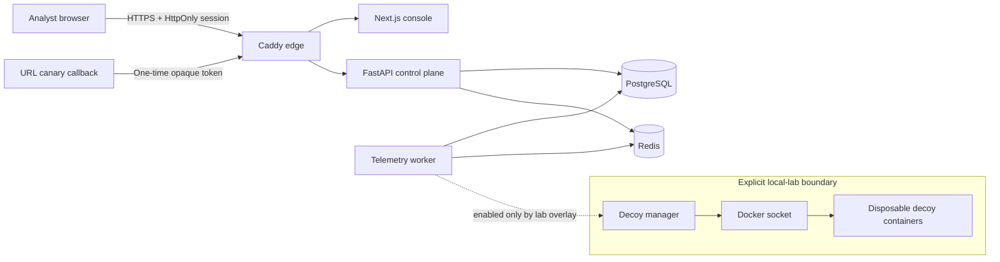

# Architecture and trust boundaries

Deception Orchestrator separates the internet-facing analyst control plane from optional decoys that run only inside an owned lab network.

## Components

| Component | Responsibility | Trust level |
| --- | --- | --- |
| Caddy | TLS termination, response hardening, and routing | Public edge |
| Next.js | Authenticated analyst experience | Control plane |
| FastAPI | Authentication, canaries, events, alerts, and investigations | Control plane |
| PostgreSQL | Durable operational state and telemetry | Private data tier |
| Redis | Event coordination | Private data tier |
| Worker | Telemetry processing; idle when local decoys are disabled | Private service tier |
| Decoy manager | Docker lifecycle operations for controlled lab decoys | High privilege, local lab only |

## Security invariants

- Production startup fails when secrets, password hashes, HTTPS URLs, or explicit CORS origins are missing.
- PostgreSQL, Redis, and the FastAPI port are not published by the production overlay.
- Browser mutations require an authenticated HttpOnly cookie plus a matching CSRF token. Bearer-token API clients are authenticated without cookie CSRF semantics.
- Session tokens use a fixed algorithm and validate subject, issuer, audience, expiry, and unique token ID.
- Production demo mode is disabled unless explicitly enabled.
- The Docker socket is mounted only by `docker-compose.lab.yml`; it is absent from the production control plane.

## Deliberate limitations

The in-process login limiter protects a single API instance. A horizontally scaled deployment should move rate-limit state to Redis or enforce it at a trusted edge. The single-admin model is suitable for a portfolio lab, not an enterprise SOC; production adoption would require external identity, RBAC, immutable audit logs, collector authentication, and a formal retention policy.
